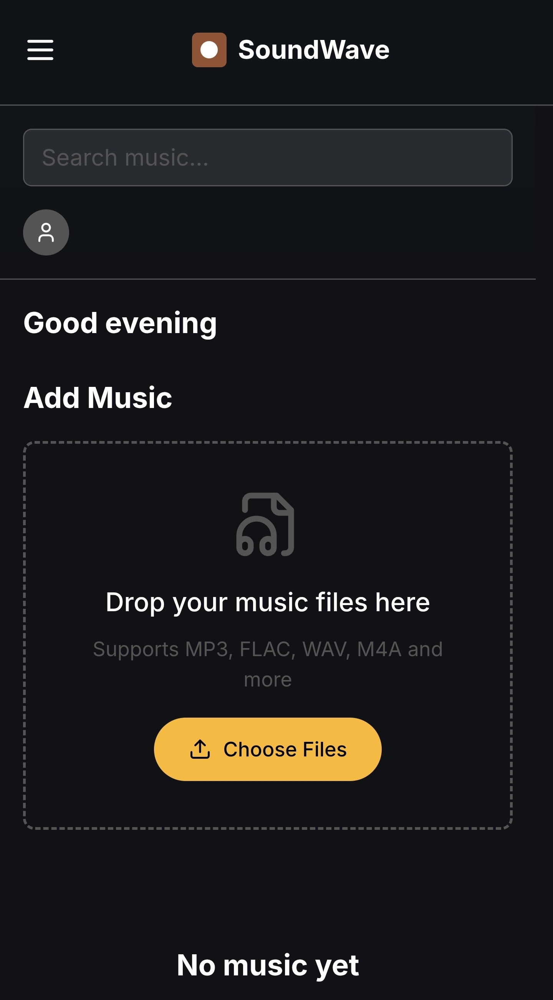

# SoundWave: Your Music, Your Way

[](https://opensource.org/licenses/MIT)

SoundWave is a progressive web audio player that puts you in control of your music. It's designed to be a modern, offline-first, and mobile-friendly music player that lets you play your own music from various sources, including local files, your device's file system, and Google Drive.

## Screenshot



## Live Site

[https://player.rayvalentinmusic.cc/](https://player.rayvalentinmusic.cc/)

## Features

*   **Multiple Music Sources:** Play music from local files, your device's file system, or Google Drive.
*   **Offline First:** Enjoy your music even without an internet connection, thanks to service workers and IndexedDB.
*   **Modern & Minimalist UI:** A clean, uncluttered, and responsive user interface inspired by Apple Music.
*   **Mobile-Friendly:** A responsive layout and mobile-specific features for a seamless experience on any device.
*   **ID3 Tag Parsing:** Automatically parse ID3 tags from your music files to get metadata like title, artist, and album art.
*   **Dynamic Backgrounds:** The "Now Playing" view features dynamic background colors extracted from the album art.
*   **PWA-Ready:** Install SoundWave on your device for a native-like experience.

## Technology Stack

*   **Frontend:**
    *   React with TypeScript and Vite
    *   Tailwind CSS with shadcn/ui
    *   wouter for routing
    *   React Query for data fetching
*   **Backend:**
    *   Express.js with TypeScript
    *   PostgreSQL with Drizzle ORM (in-memory for development)
*   **PWA & Offline:**
    *   Service Workers
    *   IndexedDB

## Getting Started

To get a local copy up and running, follow these simple steps.

### Prerequisites

*   Node.js and npm

### Installation

1.  Clone the repo

    ```sh
    git clone https://github.com/your_username_/SoundWave.git
    ```

2.  Install NPM packages

    ```sh
    npm install
    ```

3.  Start the development server

    ```sh
    npm run dev
    ```

## Usage

Once the development server is running, you can access the application in your browser at `http://localhost:3000`.

*   **Upload Music:** Drag and drop music files into the upload area, or click to select files from your computer.
*   **Scan Your Device:** Use the device scanner to find music files on your local device without uploading them.
*   **Connect to Google Drive:** Connect your Google Drive account to import music from a shared folder.

## Contributing

Contributions are what make the open source community such an amazing place to learn, inspire, and create. Any contributions you make are **greatly appreciated**.

1.  Fork the Project
2.  Create your Feature Branch (`git checkout -b feature/AmazingFeature`)
3.  Commit your Changes (`git commit -m 'Add some AmazingFeature'`)
4.  Push to the Branch (`git push origin feature/AmazingFeature`)
5.  Open a Pull Request

## License

Distributed under the MIT License. See `LICENSE` for more information.

## Acknowledgments

*   **Adolfo Ray Olguin:** The original author and creator of SoundWave.
